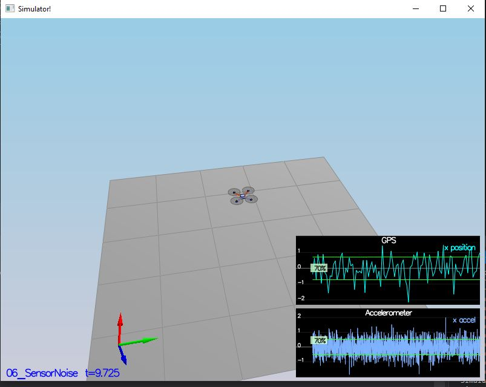
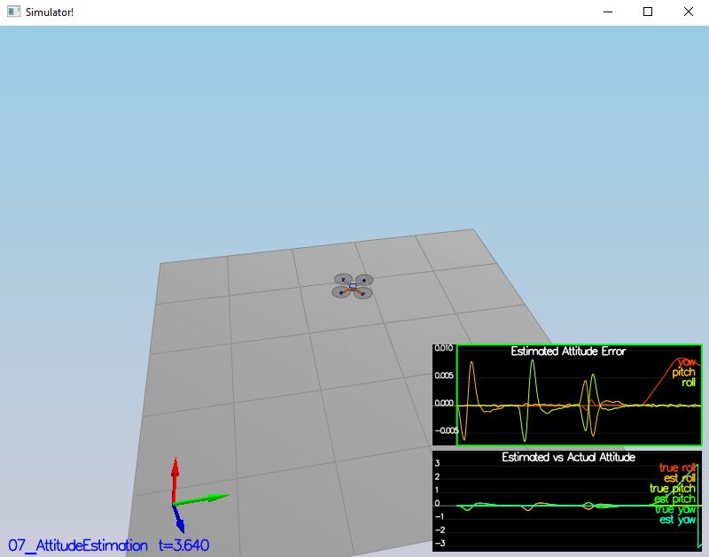
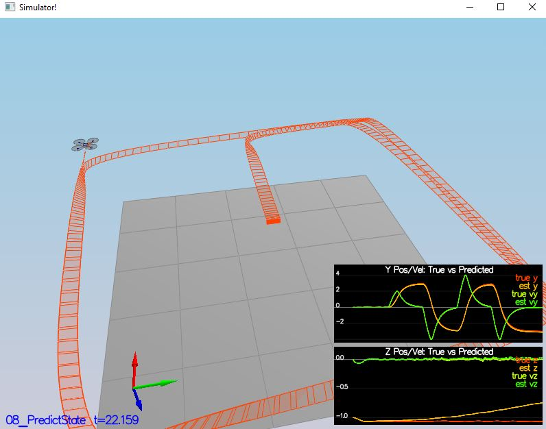
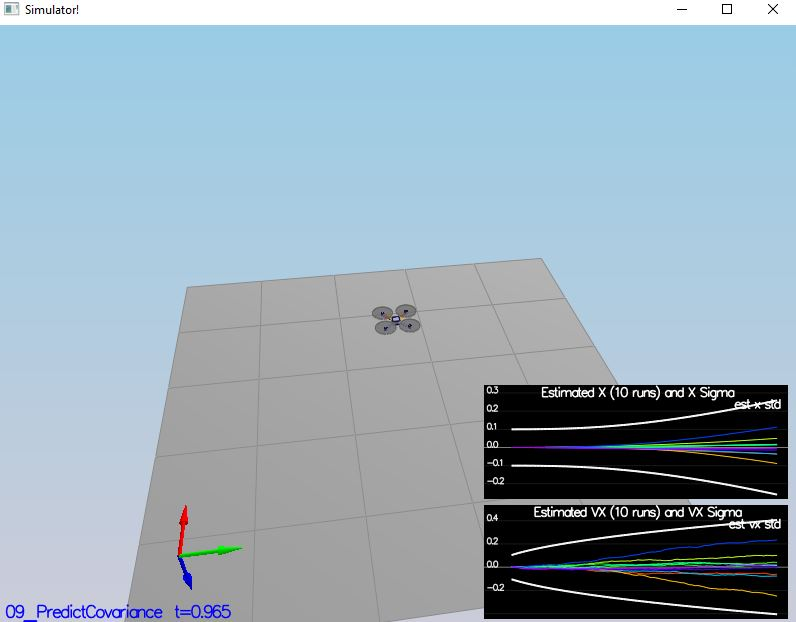
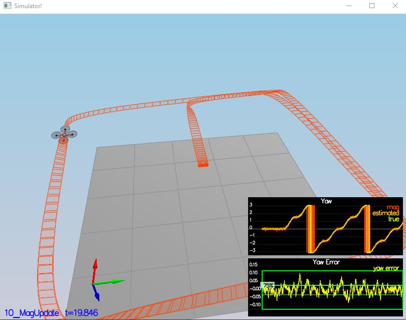
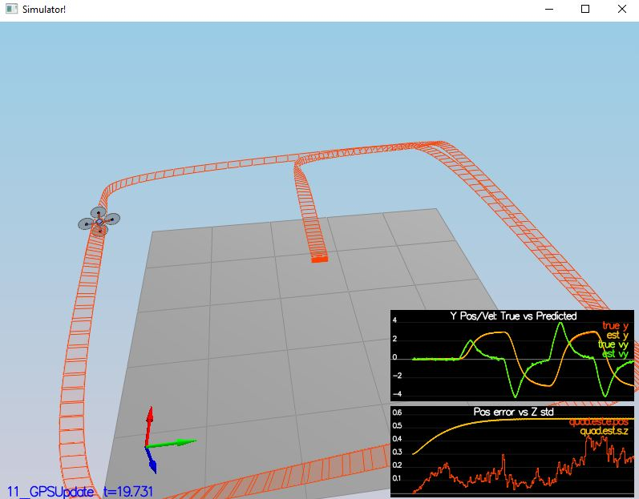

## Step 1: Sensor Noise

- Adjusted the MeasuredStdDev_GPSPosXY and MeasuredStdDev_AccelXY to the values I calculated
```
- PASS: ABS(Quad.GPS.X-Quad.Pos.X) was less than MeasuredStdDev_GPSPosXY for 71% of the time
- PASS: ABS(Quad.IMU.AX-0.000000) was less than MeasuredStdDev_AccelXY for 70% of the time

```



## Step 2: Attitude Estimation

- Implemented ```UpdateFromIMU()``` method in QuadEstimatorEKF.cpp (line 96)
```
- PASS: ABS(Quad.Est.E.MaxEuler) was less than 0.100000 for at least 3.000000 seconds
```



## Step 3: Prediction Step

- Implemented ```PredictState()``` method in QuadEstimatorEKF.cpp (line 171)
- Implemented ```GetRbgPrime()``` method in QuadEstimatorEKF.cpp (line 207)
- Tuned QPosXYStd and QVelXYStd in QuadEstimatorEKF.txt




## Step 4: Magnetometer Update

- Tuned QYawStd in QuadEstimatorEKF.txt
- Implemented ```UpdateFromMag()``` method in QuadEstimatorEKF.cpp (line 350)
```
- PASS: ABS(Quad.Est.E.Yaw) was less than 0.120000 for at least 10.000000 seconds
- PASS: ABS(Quad.Est.E.Yaw-0.000000) was less than Quad.Est.S.Yaw for 75% of the time
```



## Step 5: Closed Loop + GPS Update

- Implemented ```UpdateFromGPS()``` method in QuadEstimatorEKF.cpp (line 315)
```
- PASS: ABS(Quad.Est.E.Pos) was less than 1.000000 for at least 20.000000 seconds
```



## Step 6: Adding Your Controller

- Replaced QuadController.cpp with my controller from the previous project
- Replaced QuadControlParams.txt from the previous project
- Tweaked and de-tuned my params until I could pass all scenarios using my controller from the previous project.

